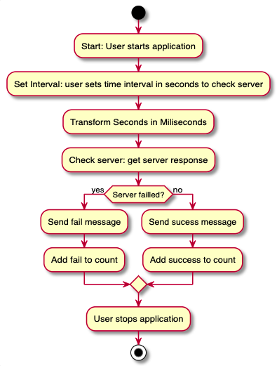

# What does this application do?
This is an application that monitors the health of the Magnificent Server. 
User will run it on the terminal, and give it as a parameter the # of seconds to wait between checks to the server 
A clear message on the terminal will tell if the server has failed or not 
It will also tell how many times the server has failed and how many times it has responded successfully

  

# How does it works?
💻 This is a [Node.js](https://nodejs.org/en/) application that uses [axios](https://www.npmjs.com/package/axios), a promise based HTTP client for the browser and node.js 
This is a simple software architecture demonstrating how the application should work:

  

# How to run this application?
1. Clone and download this repository (or fork, than clone, which would be better)
Navigate with terminal to your chosen folder and run `git clone https://github.com/discombobulateme/magnificent-challenge`
2. Open magnificent-server folder `cd magnificent-server`
3. Follow "Magnificent Server installation" bellow instructions
4. Let the server running `python server.py`(you can use a second terminal window to let the server running)
5. Go back to the previour folder `cd ..`
6. Open using-axios folder `cd using-axios`
7. Follow "Run the application passing a parameter" below instructions

## Magnificent Server installation
1. Install Python
2. pip install twisted
3. python server.py
4. Okay, now you're running magnificent!
5. Visit http://localhost:12345 in a web browser
6. It should throw a verbose error, or return "Magnificent!"

## Run the application passing a parameter
1. Install project dependencies `npm install`
2. Run the application, passing a parameter for the # of seconds between checks `node index.js <your numerical chosen parameter in seconds>`
3. To exit the application type: CTRL + C

### Error handling
You can just run the application using `node index.js`, or give no paramenter, but there will be no set interval. 
That means the program will run absurdly fast and reach 50.000 count in a split of a second 😲  
Just exit with typing `Ctrl +C` and restart using the proper parameter

# Research references
Following there's a list of useful links that helped me build this application
 
- How do you put parameters into apps running in the terminal?
[Window.prompt() MDN](https://developer.mozilla.org/en-US/docs/Web/API/Window/prompt)
[How do I prompt users for input from a command-line script?](https://nodejs.org/en/knowledge/command-line/how-to-prompt-for-command-line-input/)
[Getting User Input in Node.js](https://www.codecademy.com/articles/getting-user-input-in-node-js)
[Output to the command line using Node.js](https://nodejs.dev/learn/output-to-the-command-line-using-nodejs)
[process.argv = property returns an array containing the command line arguments passed when the Node.js process was launched](https://nodejs.org/api/process.html#process_process_argv)

- How to request HTTP infos?
[Using XMLHttpRequest](https://developer.mozilla.org/en-US/docs/Web/API/XMLHttpRequest/Using_XMLHttpRequest)
[XMLHttpRequest MDN](https://developer.mozilla.org/en-US/docs/Web/API/XMLHttpRequest)
[XMLHttpRequest.open()](https://developer.mozilla.org/en-US/docs/Web/API/XMLHttpRequest/open)

- Using AJAX -> Read data from a web server - after the page has loaded
[AJAX MDN](https://developer.mozilla.org/en-US/docs/Web/Guide/AJAX)
[AJAX w3 - Server Response](https://www.w3schools.com/XML/ajax_xmlhttprequest_response.asp)

- Using AXIOS -> Promise based HTTP client for the browser and node.js
[Axios](https://www.npmjs.com/package/axios)
[How to use Axios to send HTTP requests in vanilla JavaScript](https://attacomsian.com/blog/axios-javascript)
[Axios tutorial](http://zetcode.com/javascript/axios/)

- setInterval implementation
[WindowOrWorkerGlobalScope.setInterval()](https://developer.mozilla.org/en-US/docs/Web/API/WindowOrWorkerGlobalScope/setInterval)

